# Hello, I'm Prince Raj Singh 👋

### Welcome to my Github Profile

  

  

---

## 👨‍💻 About Me

I'm a passionate **Web Development learner** who enjoys creating modern, responsive and user-friendly websites.

- 🔭 Currently working on **Frontend Web Development**
- 🌱 Learning **JavaScript, c, c++, & Python**
- 💻 Building responsive websites and UI designs
- 🎯 Working towards becoming a **Full-Stack Web Developer**
- ⚡ I love turning ideas into real projects
- 🚀 Always learning and improving my coding skills

---

## 🛠️ Technologies & Tools

### 💻 Languages & Technologies

- 🌐 **HTML5**
- 🎨 **CSS3**
- ⚡ **JavaScript**
- 🔵 **C**
- 🟣 **C++**
- 🐍 **Python**
- 🔧 **Git & GitHub**
- 💻 **VS Code**

---

## 🚀 My Projects

### 🌐 Personal Portfolio

A modern and responsive **personal portfolio website** showcasing my skills, projects, and web development journey.

**Tech Stack:**

- HTML5
- CSS3
- JavaScript
- Bootstrap Icons

**Features:**

- 📱 Responsive Design
- 🎨 Modern UI
- 👨‍💻 About Me Section
- 🛠️ Skills Section
- 🚀 Projects Showcase
- 📞 Contact Section

**🔗 Project Link:**  
[🌐 View Portfolio](https://princerajsingh-7.github.io/New-Portfolio/)

---

### 🛒 Martify — Online Shopping Store

A modern **online shopping store website** designed to provide a smooth and user-friendly shopping experience.

**Tech Stack:**

- HTML5
- CSS3
- JavaScript
- Bootstrap Icons

**Features:**

- 🛍️ Product Display
- 🔎 Product Search
- 🛒 Shopping Cart
- 📱 Responsive Design
- 🎨 Modern User Interface
- 💳 Shopping Experience

**🔗 Project Link:**  
[🛒 Visit Martify](https://princerajsingh-7.github.io/Online-Shopping-Store/)

---

### ⚖️ Ravindra Legal Associate

A professional **Advocate Portfolio Website** designed with a modern and responsive interface.

**Tech Stack:**

- HTML5
- CSS3
- JavaScript
- Bootstrap Icons
- Font Awesome
- API

**Features:**

- 📱 Responsive Design
- ⚖️ Legal Practice Areas
- 👨‍⚖️ Advocate Portfolio
- 📋 Consultation Form
- 📞 Contact Section
- 🔗 Social Media Integration

**🔗 Project Link:**  
_Add your Ravindra Legal Associate link here_

---

     
  
    

  

  

## 📊 GitHub Stats

  
  
  

---

## 💻 Most Used Languages

  

---

## 📈 My GitHub Activity

  

---

## 📚 Learning & Improving

---

## 🤝 Connect With Me

---

## 🎯 2026 Goals

- [ ] Improve JavaScript skills
- [ ] Learn React.js
- [ ] Build more real-world projects
- [ ] Learn Backend Development
- [ ] Build Full-Stack Applications
- [ ] Contribute to Open Source

---

<h3 align="center">

🚀 Keep Learning • Keep Building • Keep Growing 🚀

</h3>

⭐ Thanks for visiting my profile!

